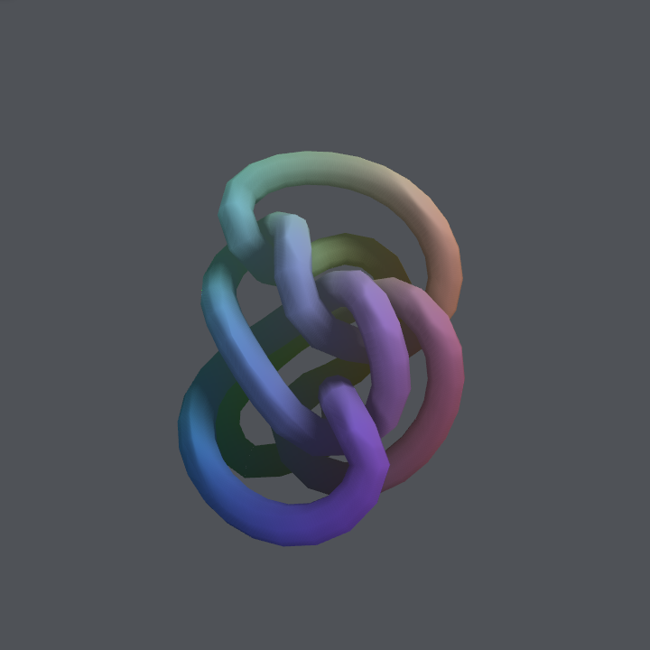
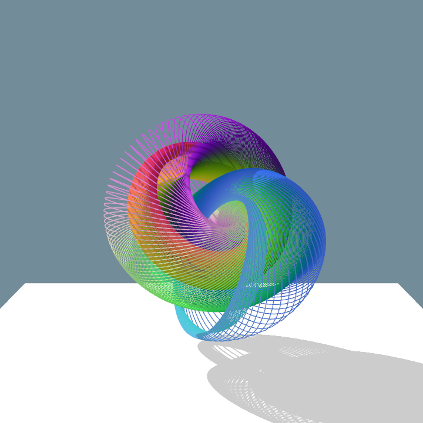
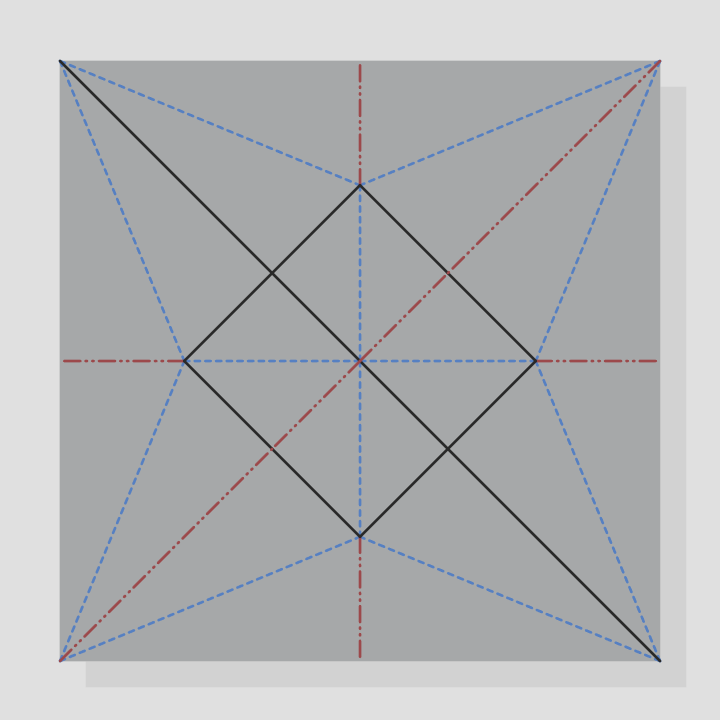
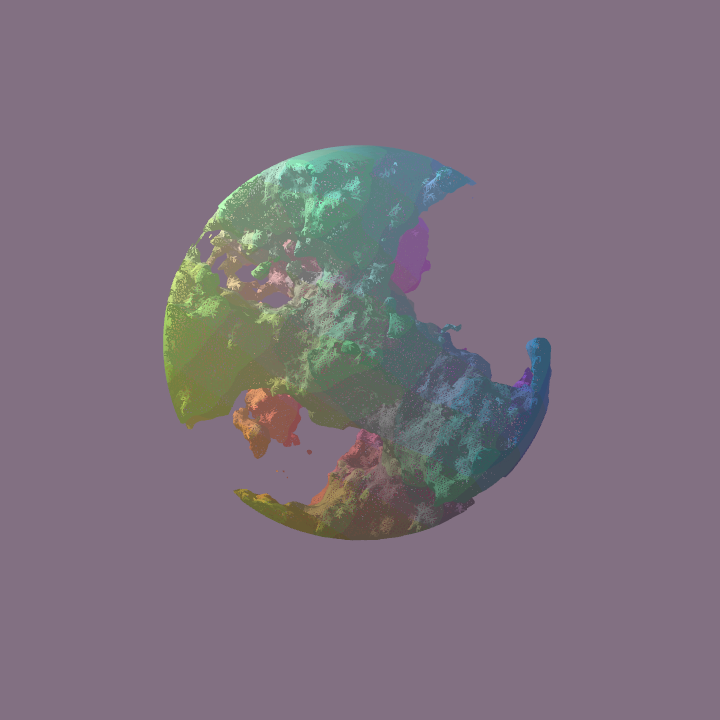
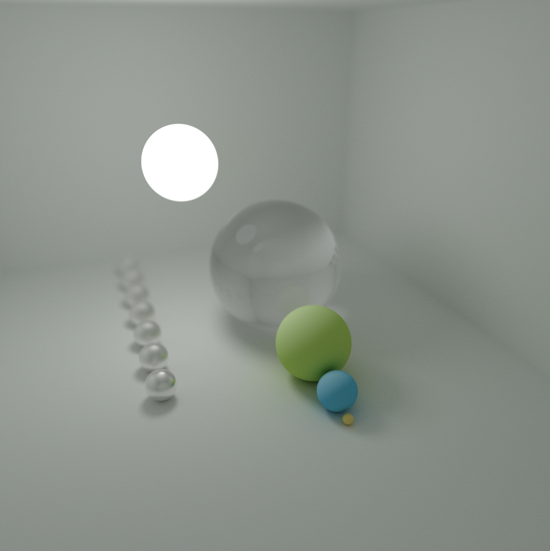
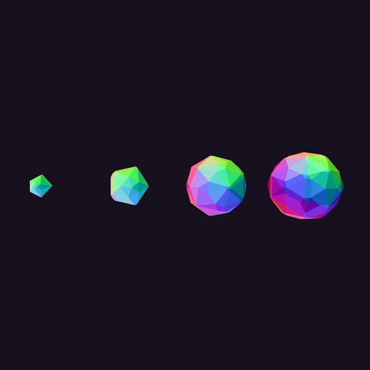
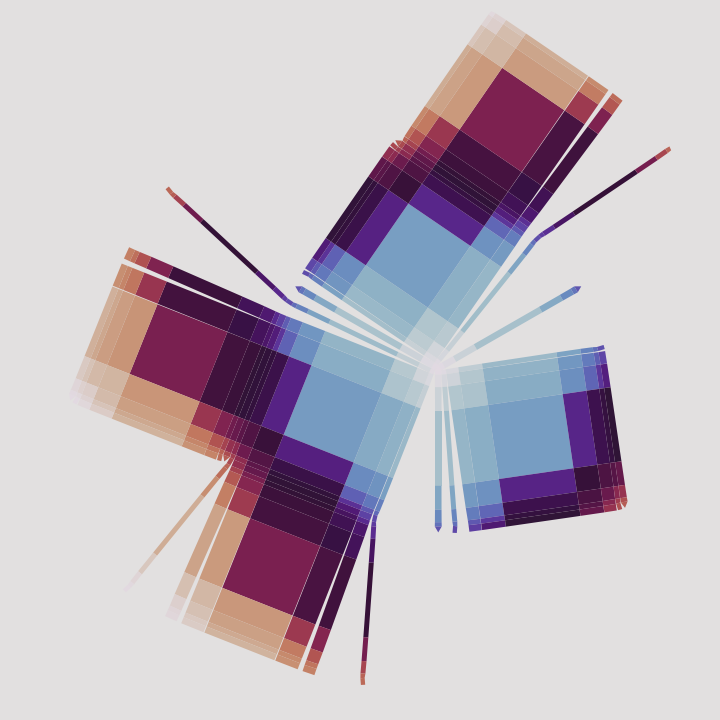

# Software Engineer & Aspiring Security Analyst

#### Technical Skills: Python, Java, C++, C, SQL, VBA, Git

## Education
B.S., Computer Science | The University of Wisconsin Madison (_May 2023_)

<i>Elective Coursework</i>
- CS /​ECE /​MATH  435 — Introduction to Cryptography
- CS /MATH /​STAT  475 — Introduction to Combinatorics
- CS /​ECE /​iSyE  524 — Introduction to Optimization
- CS /ECE ​/​ME  539 — Introduction to Artificial Neural Networks
- CS 540 — Introduction to Artificial Intelligence
- CS 542 — Introduction to Software Security
- CS 564 — Database Management Systems: Design and Implementation
- CS 577 — Introduction to Algorithms
- CS 640 — Introduction to Computer Networks
- CS 642 — Introduction to Information Security
- CS /ECE 782 — Advanced Computer Security and Privacy

<a href= "./project-crease.html">📚 Wisdom Vault</a>

## Projects
### LOCKDOWN: A Security Analysis of the 4th-Generation August WiFi Smart Lock

We explored various security components of the 4th generation August smart lock. Notably, we identified that August’s choice to integrate with services like Airbnb made viable a less-studied threat model – the Airbnb attacker – under which new classes of attacks were possible. Under this threat model, we identified two types of attacks that give an attacker persistent control of the lock: one that prevents the lock owner from deprovisioning the attacker’s guest access, and another that leverages several lock hardware vulnerabilities.

## Ongoing Research
<table style="width:100%">

  <tr>
    <td style="width:33%">
      
    </td>
    <td style="width:33%">
      
    </td>
    <td style="width:33%">
      
    </td>
  </tr>

  <tr>
    <td style="width:33%">
      
    </td>
    <td style="width:33%">
      
    </td>
    <td style="width:33%">
      
    </td>
  </tr>

  <tr>
    <td style="width:33%">
      
    </td>
  </tr>

</table>
